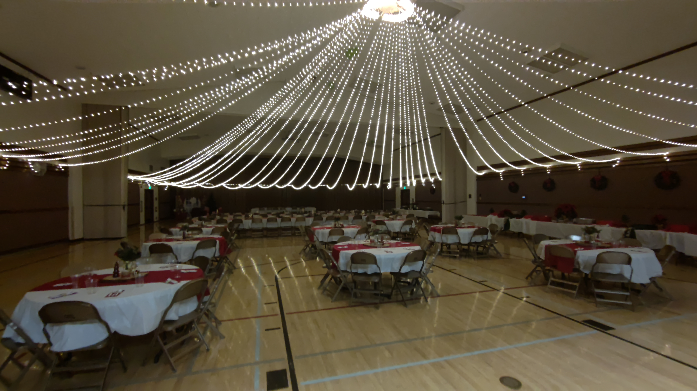
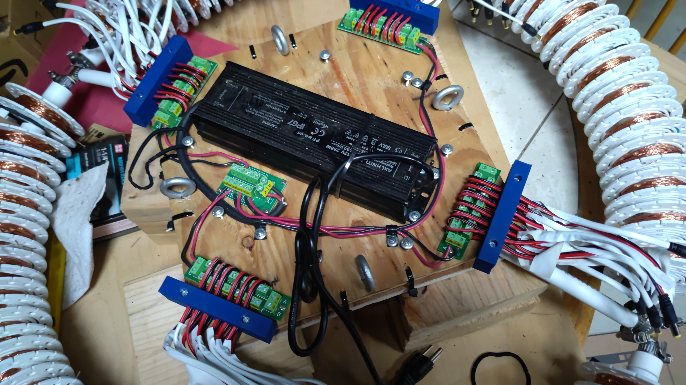
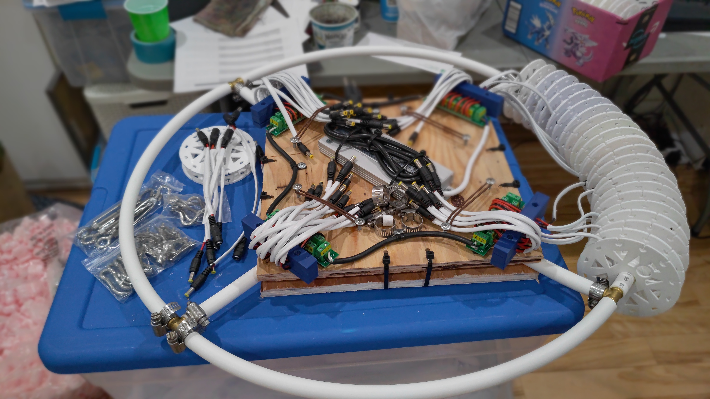
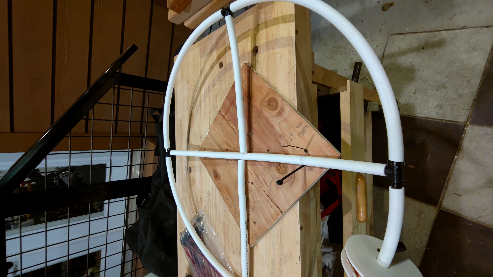
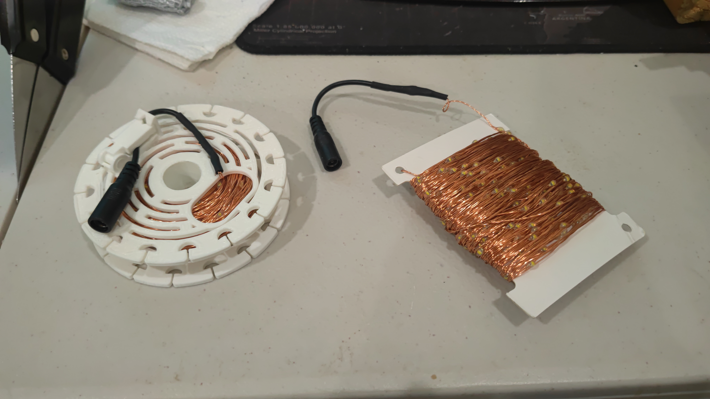
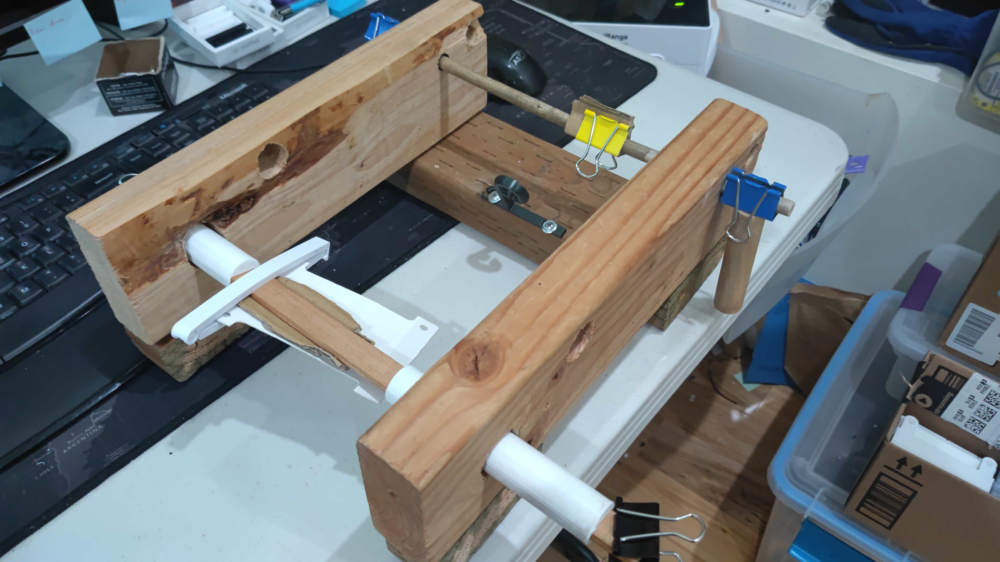
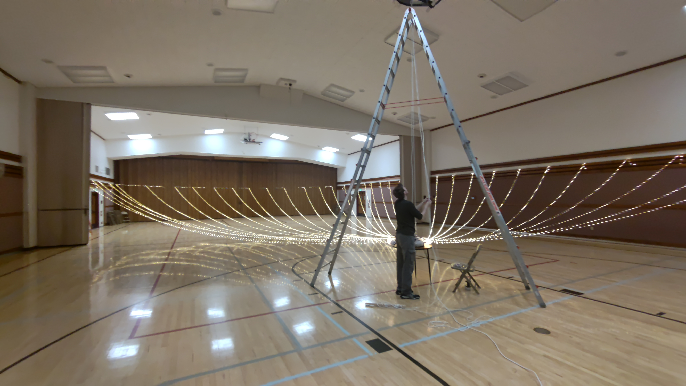

# Cultural Hall party event lighting system

This project was done initially for a wedding reception, but has been used for multiple Christmas parties. This guide is intended to assist someone through the process of creating something similar.

## Lighting system specifications

This system contains 48 12v 100 foot 'fairy light' LED strands. Each strand has 3 lights per foot for a total of 300 lights on each strand, and draws 380 milliAmps. If you want to keep it to a 15 amp draw, you would reduce the number of strands to 39. At 48, it draws 18.24 amps, so you would need a 20 amp circuit and 20 amp power cord.

Each strand is wound onto a 3d printed spool. 12 spools are mounted on a 90 degree arc of flexible piping (we used pex). 4 arcs are joined together to with pipe tees and clamped together with hose clamps to form a circle, and mounted to a center plywood platform with . The platform has 48 pigtails, 4 banks of 12, to be connected to the spool once the right amount of lighting is stretched out.

The spools have arcs cut out to allow heat to dissipate, as they can get somewhat hot when the lights are wrapped tightly together on the portion of the strand that it not needed.

Any variations in pictures from descriptions are due to learnings and modifications. As an example, some pictures show a 100W power supply and plastic tees. These parts were upgraded to 250W and metal tees. Regardless of the specific item, the general principles are the same.

## Parts

### Electrical parts

- [12v LED power supply (can supply 20.8 amps)](https://www.amazon.com/gp/product/B07Y61R8SR/ref=ppx_yo_dt_b_search_asin_title?ie=UTF8&th=1)
- [48 12v 5.5 X 2.1 mm male pigtails](https://www.amazon.com/gp/product/B07BRKGZYN/ref=ppx_yo_dt_b_asin_title_o00_s00?ie=UTF8&th=1)
- [4x 12 header power distribution block](https://www.amazon.com/gp/product/B08TBXQ7H6/ref=ppx_yo_dt_b_asin_title_o04_s00?ie=UTF8&psc=1)
- [1x 6 header power distribution block](https://www.amazon.com/gp/product/B09D3BV22M/ref=ppx_yo_dt_b_asin_title_o01_s00?ie=UTF8&psc=1)
- 50ft 20 amp standard power cord
- 48 12v 100ft fairy light strands with 5.5mm female bullet connectors.
- [4 pigtail retention blocks](cord_clamp3.3mf)

### Platform parts

- 2x plywood 12" x 12"
- 16x 12" Cable Ties
- 10 feet of flexible PEX tube 1/2" ID
- 5 feet of rigid tube 3/4"
- 4x 1/2" metal PEX Barb Tee
- 12x small hose clamps
- 48 spools
- 60 spacers

### Rigging parts

- 4x Eye Bolts with lock washers and nuts
- [Vinyl coated wire](https://www.amazon.com/gp/product/B08FY86482/ref=ppx_yo_dt_b_asin_title_o04_s00?ie=UTF8&th=1)
- heavy duty carabiners
- chain quick links
- 50lb pulley
- 100ft of quality rope

## Electrical system

The 12v LED power supply selected provides power for up to 54 100ft LED strands. Power is wired using at least 12 gauge wire to the small distribution block, and then from there to each of the large distribution blocks.

The male pigtails are wired into the distribution blocks. We covered them in white electrical tape to make them look a little nicer. Because the spool can pull on the power cable, we were very concerned about pulling the pigtails out of the distribution block. The blue retention blocks take the stress of any pulling on the connection to the distribution blocks.

We place 2 screws with a simple hair tie to keep the pigtails need when not extended to connect to the spools.

### LED Fairy Light Strands

One of the largest challenges is the fairy light aquisition. They can be found on Amazon with power bricks, remotes and controllers for $25-$30 each. that makes this project very expensive, and you have parts that you don't need. I [found a supplier on Alibaba](https://www.alibaba.com/product-detail/30m-50m-100m-200m-LED-String_62558179881.html) that would supply exactly what I needed, 100ft 12v fairy lights with 5.5x2.1 mm male pigtails for less than $5 each. This put the cost with shipping around $280.

## Platform Assembly

### Bottom Platform

Our platform is 2 pieces of 12" x 12" 1/2" plywood. We would recommend making it 15" x 15". We sandwich the ring supports in the middle of the top and bottom platform pieces. Ring supports are approx 27.5" long.  To overlap the ring supports, we cut halfway through each support at the overlap point, then used pliers to crimp the pipe flat. We drilled 16 holes in the bottom platform for cable ties to hold the supports in place.

### Top Platform

The top platform is used for the electrical power distribution as described above. Once the ring supports are attached to bottom platform with cable ties, we place the top platform on top of ring supports, and drilled 8 holes to cable tie the top and bottom together.

## Spools and Spacers

48 [spools](spool.3mf), 48 [spool clips](spool_clip.3mf), and 60 [spacers](spool_spacer.3mf) are 3d printed. We recommend gluing the spool halfs together. You will be required to glue the clip to the side of the spool.

Spools have grooves on the side to allow heat to dissipate. If you have a 100ft strand, and you only use 30ft, you will still have 70ft of tightly wrapped wire on the spool that will be lit up, and does generate heat.

Light strands come on flat carboard and need transferred to the spool. This is done by inserting the connecter through the oval hole and clipping it in place with the glued clip. We built a simple jig, and used a drill with a [brush attachment](https://www.amazon.com/Attachment-Scrubber-Cleaning-Bathroom-Laundry/dp/B07MKJQCXP?source=ps-sl-shoppingads-lpcontext&ref_=fplfs&psc=1&smid=A1QJ2W4S6R7LU2) to spin the spool. The brush provides enough tension to spin, but if the light strand gets bound, it will not pull hard enough to damage the wire.

[Transfer to Spool video](video_20211216_235544.mp4)

### Ring

Each 90 degree arc is ##" long. We place 2 spacers, then alternate 1 spool and 1 spacer for 12 total spools on the arc, ending with 2 spacers on the end. Spacers allow for the spool to spin freely. The extra spacer on the end is because of the hose clamps can be in the way.

The 4 arcs are assembled together using 1/2" barb tees and hose clamps. Use the smallest hose clamp that will work. While the extra hose clamp can be snipped, it is sharp and just gets in the way. See Top Platform picture above.

## Rigging

We drilled through the platform sandwich and installed the 4 eye bolts. We then used the nylon coated wire with wire crimps, heavy duty caribeeners, and chain quick links to build a simple suspension rig.

## Installation

In some cultural halls, you may have eye bolts that you can attach a pulley on a carabiner. We have also used the basketball backboard as an anchor point with good results. 

### Hanging

Once your pulley is hung, attach the rig to the pulley, and then place on a table in the middle of the hall. You might want a couple 3ft 2x4s to elevate it so that the spools spin freely. (Hymnals work as well!)

You'll want to run your extension cord through the carabiner at the pulley as well.

### Extend Lighting

Measure out the room so that you know how far apart along the walls you want to attach the end of the strands. For a full sized gym, it's probably 6-10 feet apart. Where there is a wood molding available, we placed small screws as anchor points hidden behind the molding.

For areas that don't have anchor points, we use nylon wire suspended between walls with anchor points (like anchoring to either side of the stage or the accordian doors), then use clothes pins or spool clips to clip the light strand to the suspended wire.

Once you have extended and anchored the correct length, use the notches on the sides of the spools to anchor the wire on the spool so that it won't spin. Connect power to the spool. You may need to unclip the connector from the side of the spool for it to reach. Be sure to not over tension the wire. You want some slack.

One issue that we ran into was accidental jarring of the strands after installation, especially when the lights were turned off and they did not see them. The tension pulling the strand too tight, and causing it to short out at far end when you wrap it around a screw. Loosening the strand to remove the tension fixed the issue. In future installations, we would probably use a [nylon spacer](https://www.amazon.com/Assortment-Electrical-Spacers-Plastic-Receptacle/dp/B0C7CLB513) around the screw to prevent this.
